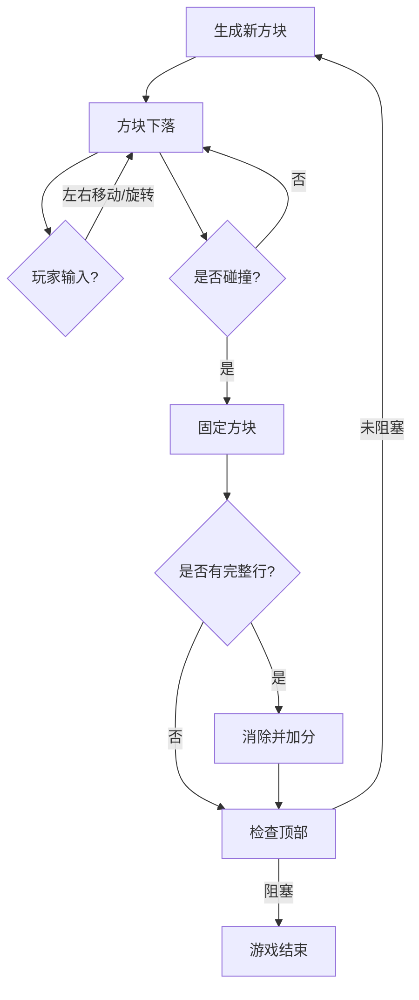

# 🎮 俄罗斯方块小游戏需求文档（前端版）

## 1. 项目背景

俄罗斯方块是经典的消除类游戏，玩法简单但极具挑战性。本项目目标是基于 **前端技术（HTML5 Canvas/React）** 实现一个轻量级、视觉炫酷的版本，保留核心玩法，不依赖后端。

---

## 2. 产品目标

* 玩家通过操作下落的方块，将它们填充到矩形区域内。
* 填满一整行则该行消除，玩家得分。
* 游戏难度逐渐加快，直到方块堆满屏幕，游戏结束。
* 提供炫酷的动画与音效，提升视觉冲击力。

---

## 3. 功能需求

### 3.1 游戏核心循环

1. **方块生成**

   * 随机生成七种基本形状（I, O, T, L, J, S, Z）。
   * 初始位置固定在顶部中间。

2. **方块下落**

   * 每隔固定时间自动下落一格。
   * 随时间推移下落速度加快。

3. **玩家操作**

   * ← → 控制左右移动。
   * ↓ 加速下落。
   * ↑ 或 空格键 → 方块旋转。

4. **方块固定**

   * 下落到底部或堆叠到已有方块时，当前方块固定。

5. **行消除**

   * 检查是否有完整的一行被填满。
   * 被填满的行消除，并触发炫酷的闪光/粒子爆炸效果。
   * 上方方块整体下落。

6. **结束判定**

   * 如果新方块无法生成（顶部被阻挡），则游戏结束。

---

### 3.2 游戏规则

* 每次消除行数不同，得分不同：

  * 单行消除：100 分
  * 双行消除：300 分
  * 三行消除：500 分
  * 四行消除（Tetris）：800 分

* 难度递增：

  * 每消除 10 行，速度加快 10%。

---

### 3.3 炫酷效果

* **方块材质**：使用渐变色、霓虹风格发光边框。
* **消除特效**：整行消失时闪烁 + 粒子爆炸动画。
* **背景**：动态渐变背景或星空粒子流动。
* **得分提示**：消除时在画面上方显示“+100”“TETRIS!!”等漂浮文字。

---

### 3.4 界面 UI

* 顶部显示：当前分数 / 最高分（存储在 localStorage）。
* 右侧显示：下一个方块预览。
* 底部显示：操作提示（← → ↓ ↑ / 空格）。

---

## 4. 技术需求

### 4.1 前端框架

* **推荐**：React + Canvas（便于状态管理 + 炫酷渲染）。
* 动画库：GSAP / Anime.js（实现粒子特效和渐变动画）。
* 样式：TailwindCSS（快速 UI 布局）。

### 4.2 数据结构

* **游戏区域**：20 行 × 10 列二维数组。
* **方块数据**：形状矩阵（4×4）。
* **状态管理**：React Hooks（useState/useReducer）。

---

## 5. 非功能需求

* **性能要求**：保证 60FPS。
* **适配性**：支持 PC 浏览器（Chrome/Edge/Safari）。
* **扩展性**：可增加“道具方块”（炸弹块、闪电块）。

---

## 6. 游戏流程图（简化）

